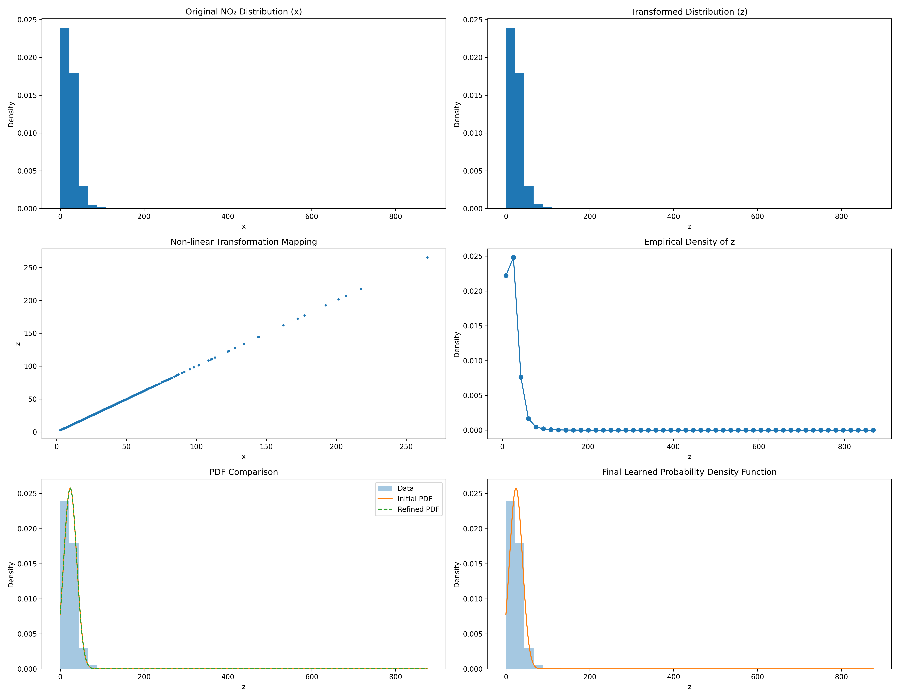

# Analysis of NO2 Levels and Non-linear Transformation

## Introduction
This document details the methodology and results from the analysis performed in the notebook `2nd_102316056.ipynb`. The analysis focuses on processing air quality data, specifically Nitrogen Dioxide (NO2) levels, and applying a unique non-linear transformation based on student identification parameters.

## Student Information
- **Student ID**: 102316056

## Methodology

### 1. Data Processing
The analysis begins by loading air quality data from an external dataset (`data.csv`). The dataset contains various pollutants, but this study isolates the **NO2 (Nitrogen Dioxide)** levels.
- **Preprocessing**: The `no2` column is extracted, and rows with missing values (NaNs) are removed to ensure specific numerical validity.

### 2. Parameter Derivation
Key transformation parameters are derived directly from the Student ID ($r = 102316056$):
- **Modulo Operations**: The ID is processed using modulo arithmetic ($r \mod 7$ and $r \mod 5$) to determine base factors.
- **Coefficients**:
    - $a_r$ is calculated based on the first modulo result.
    - $b_r$ is calculated based on the second modulo result.
    - For this specific ID, the derived values are $a_r = 0.15$ and $b_r = 0.6$.

### 3. Non-linear Transformation
A specific non-linear transformation is applied to the clean NO2 data ($x$) to generate a new transformed variable ($z$).
The transformation logic follows the equation:
$$ z = x + a_r \cdot \sin(b_r \cdot x) $$
This introduces a periodic non-linear component to the original data, altering its distribution characteristics.

### 4. Statistical Modeling
The standard deviation and variance of the new variable $z$ are calculated to estimate parameters for a theoretical probability density function (PDF).
- **Model**: A Gaussian-like model is fitted to the data.
- **Parameters**:
    - $\mu$ (Mean)
    - $\lambda$ (Precision parameter derived from variance)
    - $c$ (Normalization constant)

## Visualizations Used

The notebook employs several visualization techniques to analyze the data:

1.  **Comparative Histograms**:
    - Side-by-side histograms displaying the **Original NO2 Distribution** versus the **Transformed Distribution (z)**. This allows for visual comparison of how the transformation affects the data spread and density.

2.  **Scatter Plot (Mapping)**:
    - A scatter plot visualizing **Transformation Mapping**, plotting the original values ($x$) against the transformed values ($z$). This explicitly shows the non-linear, sinusoidal nature of the relationship.

3.  **Empirical Probability Density**:
    - A line plot visualizing the **Empirical Probability Density of z**, derived from the histogram bins. This represents the estimated probability distribution of the transformed data.

## Results

### Parameter Estimates
The analysis yielded the following initial estimates for the statistical model:
- **$\lambda$ (Lambda)**: $\approx 0.0021$
- **$\mu$ (Mean)**: $\approx 23.92$
- **$c$ (Constant)**: $\approx 0.0258$

### Final Visualization
The dataset and transformation results are summarized in the following visualization:

> **Note**: The assinmgnet is int he image.
