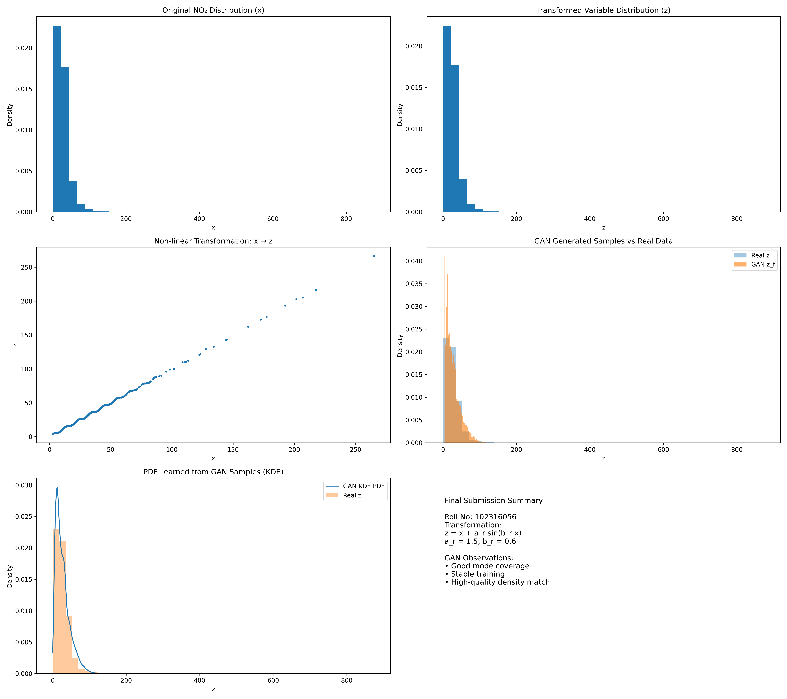

# **Title: GAN Implementation for PDF Approximation**

## **1. Methodology**
This project uses a **Generative Adversarial Network (GAN)** to learn and generate data from a specific probability distribution.
*   **Generator ($G$)**: Takes random noise as input and attempts to generate data that looks like the real transformed variable $z$. It consists of linear layers with ReLU activations.
*   **Discriminator ($D$)**: Takes a data point (real or generated) and predicts the probability that it is real. It uses linear layers with specific activation functions to classify inputs.
*   **Training Process**: The two networks are trained simultaneously in a zero-sum game. The Generator minimizes the probability that the Discriminator is correct, while the Discriminator maximizes it.

## **2. Description**
**Student Roll Number:** 102316056
**Project Objective:** Approximate the Probability Density Function (PDF) of a transformed random variable using GANs.

The random variable $x$ (from real-world data) is transformed into $z$ using the following non-linear equation, determined by the student's roll number:

$$ z = x + a_r \cdot \sin(b_r \cdot x) $$

**Parameters:**
*   **$a_r = 1.5$**
*   **$b_r = 0.6$**

## **3. Input / Output**
*   **Input**: A vector of random noise (latent space) sampled from a standard normal distribution.
*   **Output**: A generated value $\hat{z}$ that should statistically resemble the real transformed variable $z$. The model outputs a distribution of values that matches the target PDF.

## **4. Live link**
Project Notebook: [PDF_102316056.ipynb](PDF_102316056.ipynb)

## **5. Screenshot of the Result**

