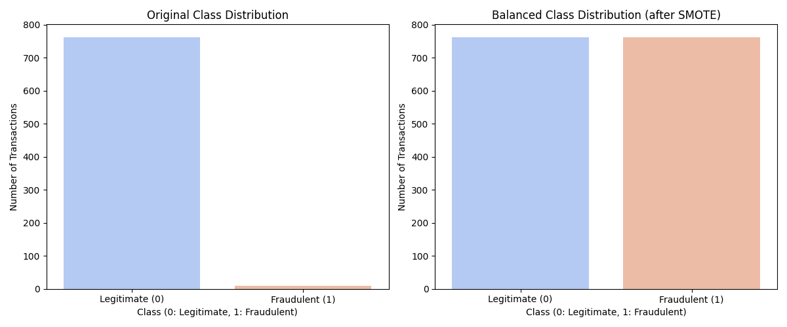

# 📊 Sampling Techniques on Imbalanced Credit Card Dataset

### Handling Class Imbalance Using Oversampling (SMOTE)

---

## 🔍 Project Overview

In real-world machine learning applications, datasets are often **highly imbalanced**, where one class significantly dominates the other. This imbalance can severely degrade model performance, especially for critical tasks such as **fraud detection**.

This project focuses on:
- 📉 **Analyzing** an imbalanced credit card transaction dataset
- 📊 **Visualizing** class imbalance
- ⚖️ **Applying SMOTE** (Synthetic Minority Oversampling Technique)
- 🚀 **Demonstrating** how oversampling improves class distribution and model reliability

---

## 🎯 Objectives

| Goal | Description |
| :--- | :--- |
| **Analyze** | Understand class imbalance in the dataset |
| **Visualize** | Compare class distribution before and after balancing |
| **Balance** | Apply SMOTE oversampling to the dataset |
| **Improve** | Eliminate class bias for better model learning |
| **Present** | Provide clear visual evidence for academic evaluation |

---

## 📁 Dataset Description

| Feature | Details |
| :--- | :--- |
| **Dataset Name** | `Creditcard_data.csv` |
| **Problem Type** | Binary Classification |
| **Target Column** | `Class` |
| **Classification** | `0` → Non-Fraud Transaction   `1` → Fraud Transaction |
| **Challenge** | ⚠️ Extreme imbalance (fraud cases are very rare) |

---

## 📊 Class Distribution Analysis

Before applying any balancing technique, the dataset is **severely skewed** toward non-fraud transactions. This causes machine learning models to favor the majority class and ignore fraudulent cases.

> **Solution:** To address this issue, **SMOTE oversampling** is applied to synthetically generate minority-class samples.

---

## 🖼️ Before vs After SMOTE Oversampling

The following visualization clearly illustrates the effect of SMOTE on class distribution:

  

### 🔹 Interpretation of the Visualization

| Phase | Non-Fraud (0) | Fraud (1) | Model Impact |
| :--- | :---: | :---: | :--- |
| **Before Balancing** | 🏆 Dominant | 📉 Very few samples | Biased toward Majority |
| **After SMOTE** | ✅ Balanced | ✅ Equal Representation | Fair & Reliable Learning |

---

## 🧠 Why SMOTE?

**SMOTE** (Synthetic Minority Oversampling Technique) improves learning by:

- ✅ **Preserving** all majority-class data  
- 🔄 **Generating** synthetic minority samples instead of duplicating data  
- ⚖️ **Reducing** model bias  
- 📈 **Improving** generalization and predictive accuracy  

> [!TIP]
> **Why not Undersampling?** 
> SMOTE is preferred over undersampling because it avoids **information loss**.

---

## 📈 Key Insights

- 🚨 **Severe class imbalance** exists in raw credit card data.
- 📉 **Visual analysis** confirms minority class under-representation.
- ✅ **SMOTE successfully balances** the dataset (50/50 split).
- 🏆 **Balanced data** leads to improved model performance and fairness.

---

